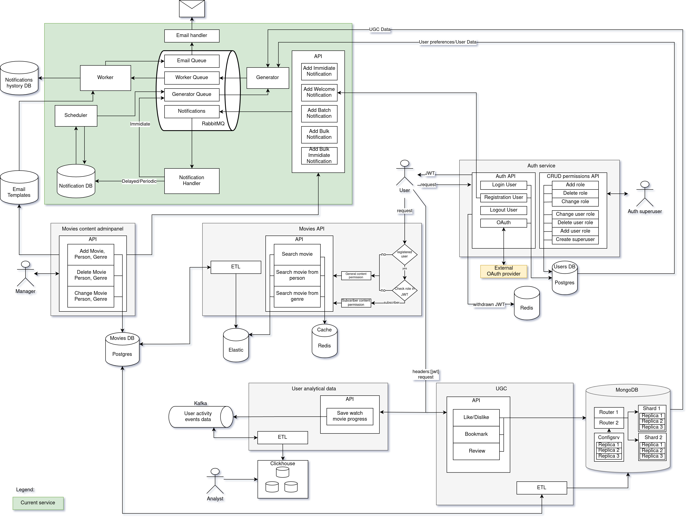

# Онлайн-кинотеатр: сервис оповещений


[](https://github.com/aigt/notifications_sprint_1/actions/workflows/main.yml)

## Описание сервиса

Сервис оповещений, с возможностями отправки:
- Одинаковых писем всем пользователям.
- Персонифицированных писем.
- Приветственных письм после регистрации пользователя.

### Технологии используемые в работе сервиса

* **MongoDB** - NoSQL база данных для хранения контента генерируемого пользователями.
* **Rabbit MQ** - Брокер для отправки сообщений.
* **FastApi** - Фреймворк для реализации приложений.
* **Nginx** - Веб-сервер для проксирования внешних запросов.
* **Sendgrid** - Сервис транзакционной рассылки уведомлений.
* **Postgres** - База данных для хранения: шаблонов писем, истории уведомлений,
уведомлений для отложенной отправки, пользователей.


### Документация

Сервис реализован в соответствии с разработанным проектным заданием:

- [documentation/Statement.md](documentation/Statement.md) проектное задание
- [documentation/notify.drawio](documentation/notify.drawio) схема архитектуры сервиса:



## CI

### GitHub Workfow

Перед слиянием с основной веткой пул реквест должен пройти проверки автоматические.


### Pre-Commit

Для атоматической предварительной проверки перед коммитом используйте [pre-commit](https://pre-commit.com/)

1. Установка - см. инструкцию на сайте: https://pre-commit.com/

2. Инициализация для автоматической проверки всех коммитов:
```bash
pre-commit install
```

3. Проверка всех файлов:
```bash
pre-commit run --all-files
```

## Репозитории сервисов инфраструктуры онлайн-кинотеатра
В инфраструктуру сервиса онлайн-кинотеатр входят следующие микросервисы:

- **Admin Panel** - панель для администрирования базы фильмов
  - https://github.com/aigt/new_admin_panel_sprint_1

- **API** - сервис предоставляющий интерфейс для работы пользователей с базой фильмов:
  - https://github.com/aigt/Async_API_sprint_2

- **Auth** - сервис авторизации и аутентификации пользователей:
  - https://github.com/aigt/Auth_sprint_1

- **Analitical Data** - сервис обработки больших объёмов аналитической информации:
  - https://github.com/aigt/ugc_sprint_1

- **UGC** - Контент создаваемый пользователями:
  - https://github.com/aigt/ugc_sprint_2

- **Notifications Service** - Сервис оповещений:
  - https://github.com/aigt/notifications_sprint_1

## Запуск сервиса

1. В директории [env_files](env_files) скопируйте и переименуйте файлы `*.env.example` в `*.env`, внесите в скопированные файлы необходимые правки

2. В корневой дериктории приложения
```commandline
docker-compose up --build -d
```

### Запуск сервиса в режиме разработки

1. В корневой дериктории приложения
```commandline
docker-compose -f docker-compose.dev.yaml up --build -d
```

## Ссылка на данный репозиторий

https://github.com/aigt/notifications_sprint_1
