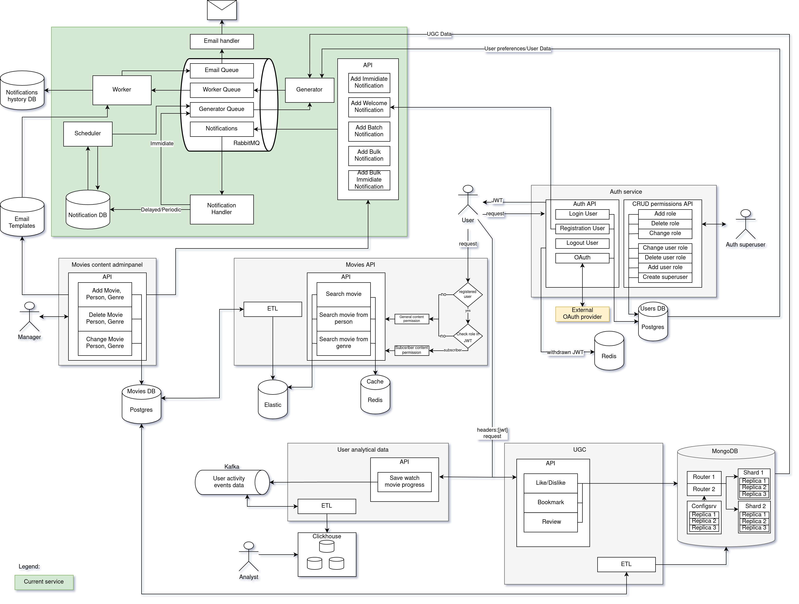

# Проектное задание

## Общее описание работы сервиса

В API приходит запрос на уведомление, апи запаковывает в стандартный формат и ставит в очередь на обработку. Хэндлер забирает и в зависимости от срочности либо передаёт в очередь генератору, либо пишет в базу для планировщика. Планировщик просыпается по расписанию смотрит какие уведомления есть на рассылку. Ставит их в очередь генератору. Генератор берёт уведомление из очереди смотрит - например это массовое уведомление - он запрашивает в базе всех пользователей по данному уведомлению с фильтром у кого в настройках стоит разрешение на рассылку, сформированный список с необходимыми данными ставит в очередь воркеру. Воркер из списка по шаблону оформляет письма и ставит их в очередь на отправку и пишет в историю, откуда они уже рассылаются почтовым сервисом.



Каждое приложение осуществляет взаимодествие с другими приложениями через очередь, что даёт:
- возможность горизонтального масштабирования
- повышения отказоустойчивости микросервиса оповещений (так как если упадёт один экземляр приложения, то на время его перезапуска на себя выполнение его обязанностей может взять другой экземпляр)
- асинхронность выполнения задач - когда одино приложение не дожидается выполнения задачи другим, при этом обеспечивается сохранность данных


## Основные компоненты сервиса

### API

Програмный интерфейс сервиса, предоставляет внешним службам поставить следующие задачи сервису уведомлений:

- Отправить welcome-сообщение
- Отправить персональное сообщение
- Отправить массовое сообщение
- Запланировать отправку персонального сообщения
- Запланировать отправку массового сообщения

Принимает задачу и передаёт её в очередь на обработку Notification handler


### Notification handler

Читает заявки на исполнение из очереди и:

- Немедленные ставит в очередь на исполнение генератору
- Остальные в зависимости от типа добавляет/обновляет/удаляет в базу для работы планировщика


### Scheduler

Планировщик просыпается по расписанию смотрит какие у него есть задачи на исполнение, однотипные объединяет и передаёт генератору на исполнение

Для планирования расписания использует cron.

### Generator

Генератор получает задачи на генерацию оповещений:

- если задача на **персональное** оповещение, то получает из базы необходимы данные для оповещения (например, имя пользователя, название сериалов с новыми сериями и тп) и ставит в задачу для воркера

- при задаче на **массовое** оповещение делает запрос по пачкам данных, создаёт пачки задач для воркера и обогащает их полученными данными как при персональном оповещении

Так же генератор получает настройки пользователя с предпочитаемым им способом оповещения. Эти данные он так же указывает в передаваемой задаче воркеру.


### Worker

Воркер читает задачи из очереди и в зависимости от указанного в них способа (или способов) генерирует по заготовленным администраторами шаблонам с данными от генератора оповещения и ставит на отправку соответствующему хэндлеру в очередь.

Не зависимо от выбранного пользователем способа доставки все оповещения пишутся в базу с историей оповещений откуда потом могут быть доступны через личный кабинет.

Стандартный алгоритм обработки задач для воркера:


### Email handler

Отсылает полученный контент на указанный адрес.


### Расширение способов оповещения

Сервис имеет возможность расширения способов доставки уведомлений. Для этого необходимо:

1. Создать хэндлер занимающийся отправкой уведомлений выбранным способом.
2. Добавить очередь для обработки задач хэндлером.
3. В воркер добавить обработчик для данного типа оповещений, который после рендеринга оповещений будет ставить их в очередь на отправку для хэндлера созданного в п.1.


## Основные сценарии работы с сервисом

### Welcome-сообщение

Auth-сервис при регистрации пользователя отправляет задачу в API сервиса уведомлений на отправку мгновенных массовых уведомлений с указаним типа оповещения welcome и указанием данных пользователя.


Пример оповещения помещаемого в очередь:

```jsonc
{
  "meta": {
    "urgency": "immidiate",
    "scale": "individual",
    "periodic": "false"
  },

  "type": "welcome",

  "fields": [
    "name": "Василий",
    "user_id": "UUID",
    "email": "email@host.com"
  ]
}
```

Пример задачи для воркера:

```jsonc
{
  "targets": [
    "email"
  ],
  "email": "email@host.com",
  "user_id": "3a815b88-c88e-4381-bcc6-fea73f052946",
  "template": "welcome",
  "fields": {
    "name": "Василий"
  }
}
```


### Вышла новая серия сериала

Админ-панель при регистрации новой серии в базе фильмов отправляет задачу в API сервиса уведомлений на отправку мгновенных массовых уведомлений с указаним типа оповещения подписка и названия сериала.


### Ваш комментарий лайкнули

UGC сервис отправляет задачу в API сервиса уведомлений на отправку не срочного персонального уведомления с указаним типа оповещения лайк комментария и указанием UUID пользователя и комментария.


### Реклама киноновинок

Админ-панель при регистрации киноновинок отправляет задачу в API сервиса уведомлений на отправку не срочного массового уведомления с указаним типа оповещения новинки и указанием UUID новинки.

### Напоминание про отложенные фильмы

Планировщик переодически ставит в очередь генератору задачу разослать напоминания. Он в свою очередь получает из базы список пользователей с давно отложенными фильмами и ставит в очередь воркеру задачу на рассылку.


### Персональная рассылка из админ-панели

Админ-панель отправляет задачу в API сервиса уведомлений на отправку мгновенных или не срочных персональных уведомлений с указаним типа оповещения рассылка.


## Схемы данных в БД

### Notifications DB

Схема в БД для данных: `notify_schedule`

Сами оповещения сохраняются в JSONB формате - подробнее о работе с форматом можно посмотреть по ссылкам:
- https://www.psycopg.org/psycopg3/docs/basic/adapt.html#json-adaptation
- https://habr.com/ru/post/254425/
- https://www.postgresql.org/docs/15/functions-json.html


Данные по несрочным персональным оповещениям:


Данные по несрочным массовым оповещениям:


### Notifications history DB

Схема в БД для данных: `notify_history`


Данные по истории оповещений:


### Templates

Схема в БД для данных: `notify_templates`

Данные по email-шаблонам:


Данные по шаблонам для истории оповещений:


## Схемы передаваемых данных в очередях

Все очереди используют Exchange с типом Direct и именем:
```jsonc
notifications
```


### Notifications и Generator Queue

Имя очередей:

- Notifications:
```jsonc
notifications
```

- Generator Queue:
```jsonc
generator
```

В очередь оповещений поступают объекты оповещений из API, в соответствии со следующей схемой:

```jsonc
{
  // Все опощещения должны иметь поле с метаинформацией необходимой для понимания сервисов
  // что делать с оповещением и куда направлять далее
  "meta": {
    // Срочность оповещения: срочно|обычно
    "urgency": "immidiate|usual",
    // Массовость оповещения: массовое|индивидуальное
    "scale": "bulk|individual",
    // Переодическое: да|нет
    "periodic": "true|false"
  },

  // Тип письма, влияет на то какие данные запросит генератор
  // и какой шаблон применит worker
  "type": "show_subs|info|welcome",

  // Опциональный параметр если нужно указать кастомный шаблон для данной рассылки
  "custom_template": "template_name",

  // Набор стандартных полей для шаблона
  // Если это массовая рассылка, то дополнительные данные будут получены генератором
  // в соответствии с типом шаблона
  "fields": {
    "login": "hello",
    "name": "Василий",
    "surname": "Сидоров",

    /* Уточняющая информация в зависимости от настроек выше: */

    // Для индивидуальных писем необходимо указать UUID пользователя, для сохранения
    // в историю оповещения и получения данных и настроек пользователя
    "user_id": "UUID",
    // Для welcome писем необходимо указать email
    "email": "email@host.com",

    ...
  }
}
```


### Worker Queue

Имя очереди:
```jsonc
worker
```

```jsonc
{
  // Сервисы доставки оповещений, выбранные пользователем в настройках
  // В базу историй оповещений, которую пользователь может просмотреть
  // из личного кабинета, сообщения пишутся всегда - явно указывать не нужно
  "targets": [
    "email",
    "sms",
    "push",
    ...
  ]

  // Адрес, куда отправить письмо
  "email": "email@host.com",

  // Для сохранения в историю оповещений
  "user_id": "UUID",

  // Шаблон для данного письма
  "template": "template_name",

  // Набор стандартных полей для шаблона
  "fields": {
    "login": "hello",
    "name": "Василий",
    "surname": "Сидоров",
    ...
  }
}
```


### Email Queue

Имя очереди:
```jsonc
email
```

```jsonc
{
  "email": "email@host.com",
  "content": "..."
}
```


## Шаблоны оповещений

Шаблоны писем используют синтаксис [jinja](https://jinja.palletsprojects.com/)

Для каждого типа рассылок (в тч сохранения истории) воркеры используют свои типы шаблонов, для того чтобы иметь возможность корректно обработать следующие ситуации:

- чтобы в смс (или в другой способ рассылки не обрабабатывающий html) не слать html

- если пользователь отказался от рассылки и смотрит только в личном кабинете, то тоже нужен будет свой шаблон чтобы отобразить в истории

### Приветственные письма после регистрации пользователя

Имя шаблона: `welcome`

Email:
```html
<!DOCTYPE html>
<html lang="ru">
<head><title>Добро пожаловать!</title></head>
<body>
  <h1>Привет {{ name }}!</h1>
  <p>Рады приветствовать тебя в нашем кинотеатре!</p>
</body>
</html>
```

History:
```
Добро пожаловать!

Привет {{ name }}!
Рады приветствовать тебя в нашем кинотеатре!
```


### Информационное письмо

Имя шаблона: `info`

Email:
```html
<!DOCTYPE html>
<html lang="ru">
<head><title>Для информации.</title></head>
<body>
  <h1>{{ title }}</h1>
  <p>{{ text }}</p>
</body>
</html>
```

History:
```
{{ title }}

{{ text }}
```

### Информация о новой серии

Имя шаблона: `show_subs`

Email:
```html
<!DOCTYPE html>
<html lang="ru">
<head><title>Вышла новая серия.</title></head>
<body>
  <h1>{{ title }}</h1>
  <h2>{{ movie }}</h2>
  <p>{{ text }}</p>
</body>
</html>
```

History:
```
{{ title }}
{{ movie }}

{{ text }}
```
